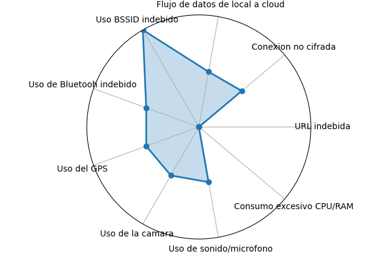
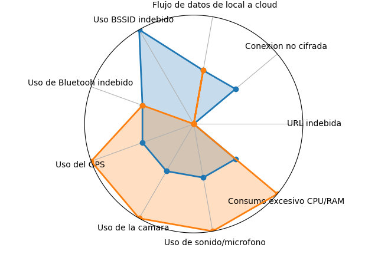
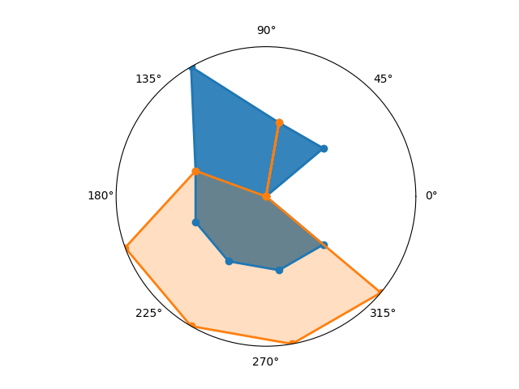
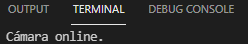
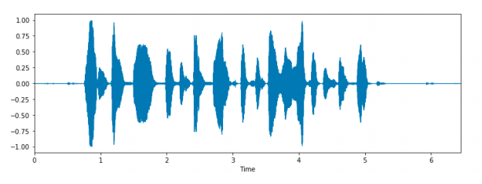
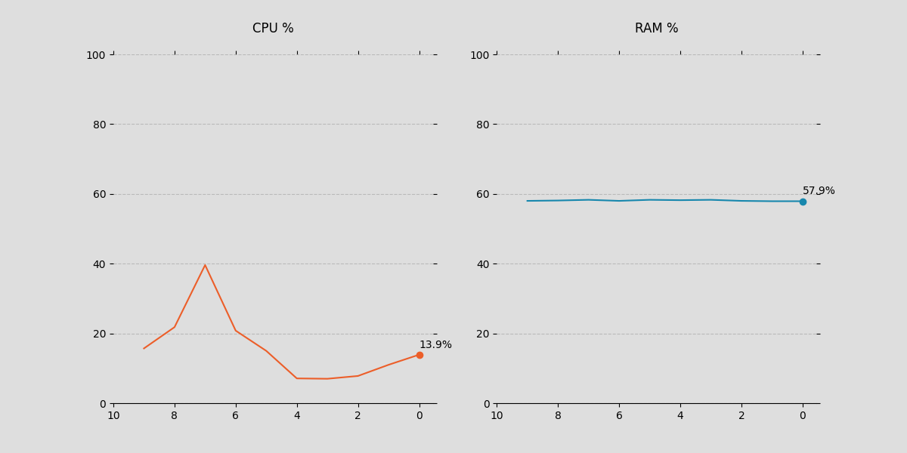

# Parametros Intrusiones
La información que recogen estos 9 parámetros (se pueden añadir más a posteriori) nos permite mediante Inteligencia Artificial(IA) conocer si el dispositivo está siendo atacado o no. Esto se consigue realizando un gráfico en coordenadas polares (aunque podría ser cualquier otro tipo de gráfico) que la IA sea capaz de reconocer. Una vez el modelo esta entrenado la IA es capaz de reconocer si un gráfico de un instante (o varios instantes) corresponde al gráfico de una intrusión o no.

Para hacer este texto inicial mas claro y sencillo de entender se muestran a continuación las imagenes que la Inteligencia Artificial usa para determinar si estamos ante una intrusión o no.

Gráfico de un solo instante:

Gráfico de varios instantes:

Gráfico limpio:

Los nueve parametros a determinar inicialmente son los siguientes: Destino de url desconocido o no autorizado, Comunicación no cifrada (https), Traspaso de datos locales a otro almacenamiento, Uso o conexión a BSSID no permitida o desconocida, Uso o conexión a Puerto Bluetooh no permitida o desconocida, Uso o conexión a GPS no permitida o no autorizada, Uso o conexión a cámara no permitido o desconocido, Uso de dispositivo de audio (micro / altavoz) no permitido o desconocido, Monitorización de parámetros físicos (velocidad, temperatura, batería) con resultado anormal

Para definir estos parametros se van a utilizar los siguientes lenguajes: Python, Java, Kotlin. Además se utilizaran las herramientas de desarrollador que ofrece Google para Android.
Además de estos lenguajes, para definir estos parámetros se van a utilizar IDS's: Snort, Kismet y Suricata o similares

Para definir, imprimir y guardar los gráficos se va a utilizar: Python, JavaScript y Java

### 1.- Destino de url desconocido o no autorizado (SNORT)
Las siguientes dos reglas de SNORT (o IDS similar) definen este parámetro

log tcp $HOME_NET any -> !DireccionIPConfianza any (sid: 1000001; rev: 001;) 

log tcp any any -> !DireccionIPConfianza any (sid: 1000001; rev: 001;)

La regla puede ser definida de dos maneras, una inicial en la que utilizamos la variable “HOME_NET” previamente definida en la que vamos a especificar cuál es nuestra red o una segunda forma en la que no especificamos la red que estamos utilizando, creamos la regla con “any” y aun siendo menos eficiente en cuanto a recursos nos aseguramos de que funcione en cualquier situación. La regla puede leerse de la siguiente manera: “Crea un log cuando se utilice el protocolo tcp desde nuestra red para mandar paquetes desde cualquier puerto a una dirección distinta a la dirección de confianza en cualquier puerto”

### 2.- Comunicación no cifrada (https)
Las siguientes dos reglas de SNORT (o IDS similar) definen este parámetro

log tcp $HOME_NET any -> any any (content:"http"; sid: 1000002; rev: 001; ) 

log tcp any any -> any any (content:"http"; sid: 1000002; rev: 001; )

La regla puede ser definida de dos maneras, una inicial en la que utilizamos la variable “HOME_NET” previamente definida en la que vamos a especificar cuál es nuestra red o una segunda forma en la que no especificamos la red que estamos utilizando, creamos la regla con “any” y aun siendo menos eficiente en cuanto a recursos nos aseguramos de que funcione en cualquier situación. La regla puede leerse de la siguiente manera: “Crea un log cuando se utilice el protocolo tcp para mandar paquetes desde cualquier puerto a cualquier dirección y puerto con contenido “http”.

### 3.- Traspaso de datos locales a otro almacenamiento
Las siguientes dos reglas de SNORT (o IDS similar) definen este parámetro

log tcp $HOME_NET !puerto_confianza -> any any(sid: 1000003; rev: 001;)

log tcp any !puerto_confianza -> any any(sid: 1000003; rev: 001;)

La regla puede leerse de la siguiente manera: “Crea un log cuando se utilice el protocolo TCP para mandar paquetes desde cualquier puerto que no sea el de confianza a cualquier dirección y puerto.

### 4.- Uso o conexión a BSSID no permitida o desconocida

### 5.- Uso o conexión a Puerto Bluetooh no permitida o desconocida
Para dispositivos Windows, se puede utilizar Kismet o bien integrarlo en Python utilizando la librería PyBluez que nos permite obtener el estado de la conexión bluetooth.

Para Android, Se puede utilizar BluetoothProfile interfaz (colección de métodos y constantes) definida por Google para manejar el Bluetooth en los dispositivos Android. Además necesitaremos utilizar otra interfaz: ServiceListener que nos permitirá listar de manera más rápida los estados (constantes) que buscamos: 

STATE_CONNECTING: Dispositivo en estado de conexión. 

STATE_DISCONNECTING: Dispositivo en estado de desconexión. 

STATE_CONNECTED: Dispositivo conectado. 

STATE_DISCONNECTED: Dispositivo desconectado. 

Estos estados pueden parecer iguales dos a dos la diferencia es que en los dos primeros obtendremos el estado de nuestra conexión bluetooth, es decir, si tenemos activado o no el bluetooth y en los dos últimos obtendremos información acerca de si estamos conectados como tal o no. Un dispositivo puede tener el bluetooth activo pero no estar conectado a ningún otro dispositivo.

https://developer.android.com/reference/android/bluetooth/BluetoothProfile

### 6.- Uso o conexión a GPS no permitida o no autorizada
Para dispositivos Windows, se puede utilizar Kismet o bien integrarlo en Python utilizando la librería gpsd que nos permite obtener la posición del gps al ejecutar el script. Si no existe conexión no obtendremos ninguna posición y por lo tanto podremos almacenar el valor como un “0” y si obtenemos una posición cualquiera, almacenaremos el valor como un “1”

Para Android, Se puede utilizar GnssStatus.Callback clase definida por google para manejar el sistema global de navegación por satélite en los dispositivos android. Se pensó en utilizar GpsStatus pero no se podría monitorizar “GLONASS”, “GALILEO”,“BEIDOU”, etc. 

Además utilizaremos el método definido onStarted() que nos avisa cuando GNSS se activa y onStopped() su análogo para cuando el proceso se detiene.

https://developer.android.com/reference/android/location/GnssStatus

### 7.- Uso o conexión a cámara no permitido o desconocido

Para dispositivos Windows, Se utiliza la biblioteca cv2 en python, que nos permite tener control sobre los dispositivos de vídeo, en este caso para comprobar si la cámara está activa o no al ejecutar el fichero. En el caso de que la cámara está online para el entorno de pruebas nos aparece un mensaje como este:

Y además almacenaremos el valor como un “1” en la variable determinada para realizar el gráfico con el resto de parámetros. Si por el contrario la cámara está “offline", en el entorno de pruebas nos muestra el siguiente mensaje:

En este caso se almacenaría el valor “0” a la hora de realizar el gráfico.

Para dispositivos Android, utilizamos android.hardware.camera2 y utilizamos el callback de Android: CameraDevice.StateCallback que incluye el método onOpened(CameraDevice camera), que nos devuelve si la camara esta  abierta o no.

https://developer.android.com/reference/android/hardware/camera2/package-summary

https://developer.android.com/reference/android/hardware/camera2/CameraDevice.StateCallback

### 8.- Uso de dispositivo de audio (micro / altavoz) no permitido o desconocido
Para dispositivos Windows, se utiliza python y la biblioteca pyaudio la cual nos permite capturar una señal de audio a través del micrófono y posteriormente visualizar su representación temporal. La idea es capturar la onda de audio en el instante de tiempo que consideremos y si esa onda no es plana, el micrófono estaría activo.

Para Android, se puede utilizar AudioManager clase definida por google para manejar el micrófono en los dispositivos android. Además necesitaremos utilizar la clase Context y la String AUDIO_SERVICE. 

Podemos comprobar fácilmente desde la API 11 de android (correspondiente a HoneyComb - Android 3.O.x) si el micrófono está en uso, utilizando la constante definida: MODE_IN_COMMUNICATION / MODE_IN_CALL.

Los pasos a seguir para crear la estructura serían: 

1.- Utilizar getSystemService(java.lang.String) 

2.- Incluir la clase Context y la String AUDIO_SERVICE: getSystemService(Context.AUDIO_SERVICE) 

3.- Incluir la sentencia creada en el paso 2 en la clase AudioManager: (AudioManager)context.getSystemService(Context.AUDIO_SERVICE); 

4.- Actualmente el método getMode asociado a AudioManager nos ofrece 5 resultados: 

MODE_NORMAL: No hay llamadas ni acciones establecidas.
MODE_RINGTONE: Hay una petición al micrófono.
MODE_CALL_SCREENING: Hay una llamada conectada pero el audio no está en uso. 
MODE_IN_CALL: Hay una llamada telefónica.
MODE_IN_COMMUNICATION: Existe alguna aplicación que está realizando comunicaciones de audio/video o VoIP.

Por lo tanto si el método nos devuelve un “MODE_IN_CALL” or “MODE_IN_COMMUNICATION”, tendremos el micrófono activo.

https://developer.android.com/reference/android/media/AudioManager

https://developer.android.com/reference/kotlin/android/content/Context

### 9.- Monitorización de parámetros físicos (velocidad, temperatura, batería) con resultado anormal

Para dispositivos Windows, se utilizará Python y la biblioteca psutil la cual nos permite monitorizar y recuperar información sobre el sistema tales como CPU, RAM, Uso de disco, Red o batería. Además es multiplataforma lo que nos permitirá en un futuro integrarla sobre cualquier sistema operativo.

Se puede generar el log utilizando solo psutil y estableciendo a partir de qué % de utilización y tras cuánto tiempo sostenido dicho % sería considerado un uso anormal en los parámetros físicos (velocidad, temperatura y bateria)

Además si queremos poder monitorizar en tiempo real lo que ocurre tanto con la CPU como con la RAM debemos utilizar la biblioteca matplotlib para generar gráficos a partir de datos contenidos en listas o arrays.

